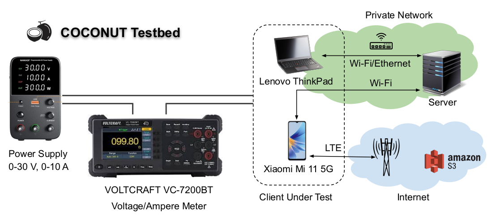
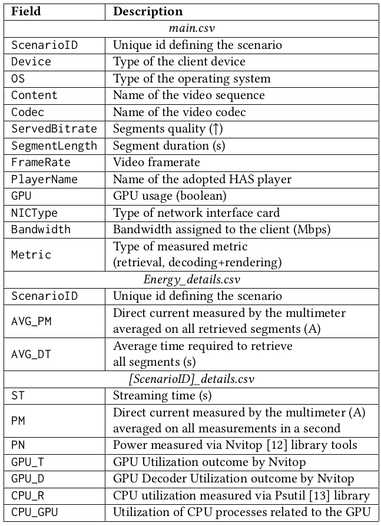

# COCONUT: Content Consumption Energy Measurement Dataset for Adaptive Video Streaming

COCONUT is a dataset for adaptive video streaming collected through a digital multimeter on various types of client devices, such as laptop and smartphone, streaming MPEG-DASH segments. COCONUT investigates the influence of multiple codecs, various video encoding parameters, such as segment length, framerate, bitrates, and resolutions, and decoding type, i.e., hardware or software, on energy consumption. We gather and categorize these measurements based
on segment retrieval through the network interface card (NIC), decoding, and rendering. Additionally, we compare the impact of different HAS players on energy consumption. This research offers valuable perspectives on the energy usage of streaming devices, which could contribute to creating a media consumption experience that is both more sustainable and resource-efficient.

Our testbed comprises a HAS client (smartphone or laptop), supplied by a power supply with defined voltage between 0 and 30 V, and a HAS server that communicate either via Wi-Fi™ (smartphone, latpop), Ethernet (laptop), or LTE (smartphone). Furthermore, a Voltage/Ampere meter is required to collect energy consumption data from the client. An overview of the testbed is presented as follows:




The data available in COCONUT are presented and described in the following Table. The main.csv file is necessary to access the desired collec-
tion of energy measurements and contains the information relative to each scenario, defined by the unique identification sequence
ScenarioID. Each line in the main.csv file represents a different scenario for which one of the following collections of measurements have been made available. The first collection refers to the retrieval measurements for both Laptop and Smartphone, stored in the file Energy_details.csv, which contains measurements related to the current intensity (A) and download time (sec) for each scenario, both averaged over all retrieved segments. The second collection is contained in the  [ScenarioID]_details.csv and stored in scenario_details folder. Each CSV file represents a series of measurements for decoding+rendering with NIC disabled gathered by the multimeter during the reproduction. These measurements are then grouped based on the streaming time ST and averaged on a second-basis, excluding the first 3 seconds since the measurements are biased by the player initialization. Whereas
PM is available for both devices and refers to the current intensity measured by the multimeter, the last 5 columns, namely PN, GPU_T,
GPU_D, GPU_R, and GPU_CPU, are only available for the laptop, as outcome by [Nvitop](https://pypi.org/project/nvitop/0.2.5.1/)  and [Psutil](https://pypi.org/project/psutil/) .  Note that for Smartphone, the second collection includes only ST and PM since Nvitop and Psutil cannot run on the Smartphone.  In addition to the data presented above, for each video content and frame, we provide PSNR, VMAF, SI and TI values in the file content_details folder.




## Contributors
* Farzad Tashtarian - Christian Doppler Laboratory ATHENA, Alpen-Adria-Universitaet Klagenfurt - farzad.tashtarian@aau.at
* Daniele Lorenzi - Christian Doppler Laboratory ATHENA, Alpen-Adria-Universitaet Klagenfurt - daniele.lorenzi@aau.at
* Hadi Amirpour - Christian Doppler Laboratory ATHENA, Alpen-Adria-Universitaet Klagenfurt - hadi.amirpour@aau.at
* Samira Afzal - Christian Doppler Laboratory ATHENA, Alpen-Adria-Universitaet Klagenfurt - samira.afzal@aau.at
* Christian Timmerer - Christian Doppler Laboratory ATHENA, Alpen-Adria-Universitaet Klagenfurt - christian.timmerer@aau.at


## Citation
```
@inproceedings{tashtarian2024coconut,
  author = {{Tashtarian, Farzad and Lorenzi, Daniele} and Amirpour, Hadi and Afzal, Samira and Timmerer, Christian},
  title = {{COCONUT: Content Consumption Energy Measurement Dataset for Adaptive Video Streaming}},
  year = {2024},
  isbn = {9798400704123},
  publisher = {Association for Computing Machinery},
  address = {New York, NY, USA},
  url = {https://doi.org/10.1145/3625468.3652179},
  doi = {10.1145/3625468.3652179},
  booktitle = {Proceedings of the 15th ACM Multimedia Systems Conference},
  keywords = {Dataset, Energy, HTTP Adaptive Streaming, Decoding, Video Player},
  location = {Bari, Italy},
  series = {MMSys '24}
}

```
